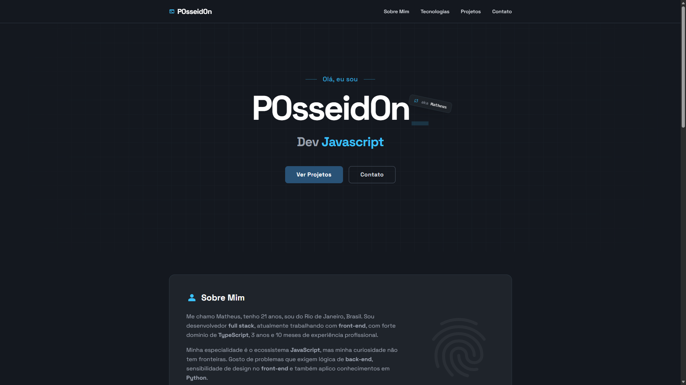

# P0sseid0n.dev

Meu portfólio pessoal, feito com Vue 3, TypeScript, Tailwind CSS e GSAP.

🔗 **[p0sseid0n.dev](https://p0sseid0n.dev)**



## Sobre

Site estático (SSG) com tema escuro e as seções Sobre, Tecnologias, Projetos e Contato. As animações respeitam a preferência de movimento reduzido (`prefers-reduced-motion`) do sistema.

A seção de projetos é montada automaticamente durante o build: um plugin do Vite (`plugins/githubPinned.ts`) busca os repositórios fixados no meu perfil do GitHub e usa a descrição, a linguagem, as estrelas e os topics de cada um.

## Stack

- **Vue 3** + **TypeScript**
- **Vite** + **vite-ssg** (geração estática)
- **Tailwind CSS 4**
- **GSAP** (animações)
- **Iconify** (`@iconify/vue`)

## Rodando localmente

Requer [Bun](https://bun.sh) (ou Node `^20.19` / `>=22.12`).

```sh
bun install       # instala as dependências
bun run dev       # servidor de desenvolvimento
bun run build     # type-check + build estático em dist/
bun run preview   # serve o build localmente
```

### Variáveis de ambiente

Copie o arquivo de exemplo e preencha o que precisar:

```sh
cp .env.example .env
```

| Variável       | Obrigatória | Descrição                                                                             |
| -------------- | ----------- | ------------------------------------------------------------------------------------- |
| `GITHUB_TOKEN` | Não         | Token usado nas chamadas à API do GitHub, para evitar o limite de requisições anônimas. |

Se a busca dos repositórios falhar, o build continua e a seção de projetos fica vazia.

## Scripts

| Script       | O que faz                                  |
| ------------ | ------------------------------------------ |
| `dev`        | Inicia o Vite em modo de desenvolvimento   |
| `build`      | Roda `type-check` e `build-only` em paralelo |
| `type-check` | Checa os tipos com `vue-tsc`               |
| `lint`       | Roda o ESLint com `--fix`                  |
| `format`     | Formata `src/` com o Prettier              |
